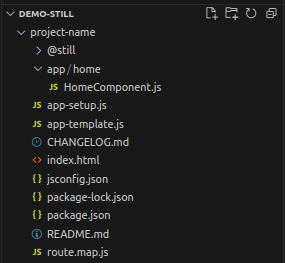
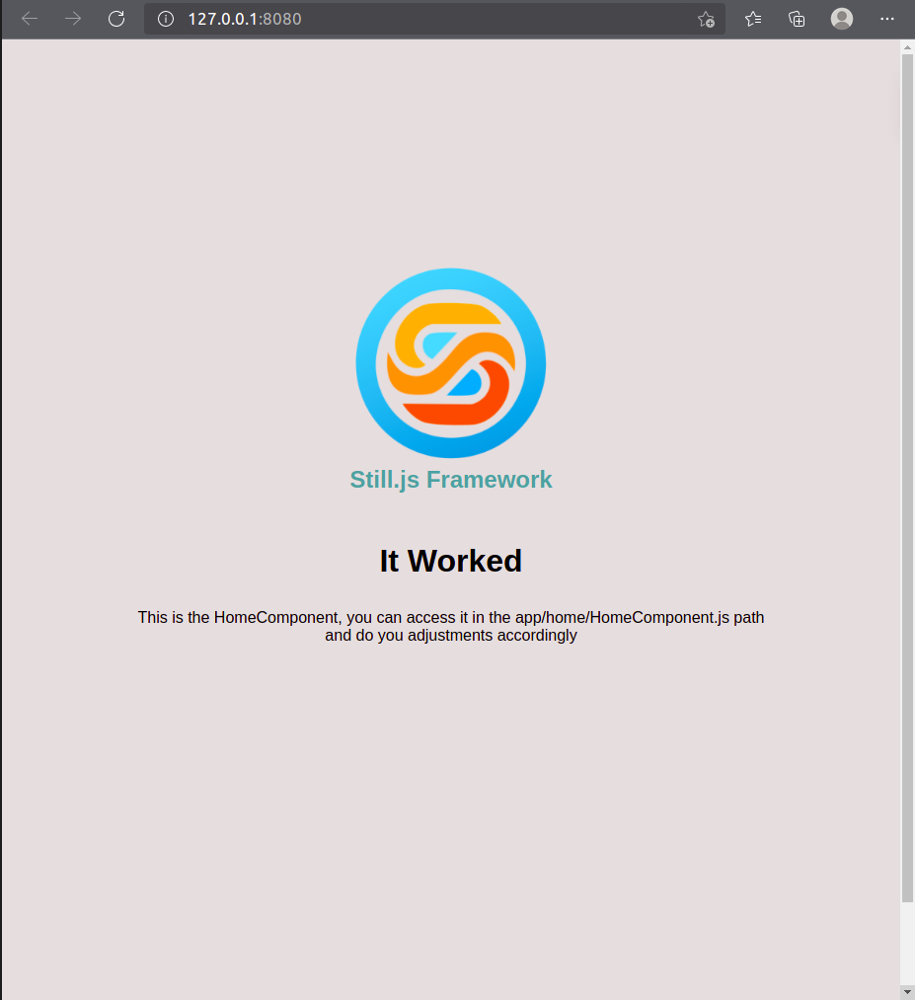

###  Creating a Still.js Project
<hr/>


#### 1. Installation

```
npm install @stilljs/cli -g
```

In pricinple, still.js application development process is tied to the NPM, therefore, for it to be available in our machine we need to make a global (-g) installation.

Once installed, still-cli can be invoked from the terminal by typing `npx still` to see the available commands and ooptions.

<br>

#### 2. Creating a project

```
npx still create project project-name
```

After creating a project a new folder is created with the name that was specified.


<br>

#### 3. Acessing the project (Project structure)



In the above picture we have the project structure open in the code editor, everything concerning the project will be created inside the <a><b>app</b></a> folder. Inicially the <a><b>app</b></a> folder comes with one component which path is <a><b>app/home/HomeComponent.js</b></a> as also depicted in the picture.


<br>

#### 4. Running the project

`npx still app serve`

The above command needs to bu run in the terminal from the project folder as dipicted bellow:


<br/>
After typing for serving the project it gets oppened automatically in the browser as in the bellow picture:



<h2>You're all set! enjoy your coding.</h2>
<br/>